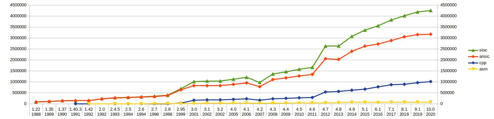

В очередной раз увидел на Хабре статью про сложное дело под названием «программирование». 
И то, что программирование действительно является делом не простым воспринимается как факт и обычно не требует какого либо подтверждения.

Но понятие «сложность» сродни термину «куча». 
Для кого-то и пять кокосов это не куча, а кого-то съел один и «больше не хочется» - значит для него и единственного кокоса будет много.

Так и со сложностью ПО. Вроде бы увеличение сложности является для всех очевидным и наблюдается во всех сферах применения IT технологий, 
да и сами языки программирования по мере своего развития становятся все сложнее, 
а вот оценивать «сложность» с помощью численных метрик — дело заведомо неблагодарное, но и «нельзя управлять тем, что невозможно измерить ...».

Обычно разговоры о «сложности» включают в себя только оценочные суждения без какой либо численной оценки. 
А так как лично меня интересует вопрос сложности языков программирования, 
то я решил  посчитать сложность реализации компилятора gcc в каких нибудь условных попугаях. 
Вдруг можно будет увидеть какие нибудь закономерности?

## Выбор «попугаев» для измерения
Я не стал придумывать свои или вычислять эмпирические метрики [программного кода](https://habr.com/ru/company/intel/blog/106082/), 
и в качестве «попугая» решил взять самую простую метрику SLOC (англ. Source Lines of Code) — количество строк исходного текста компилятора, 
которая очень легко вычисляется.

Правда, с её помощью можно будет оценивать сложность языка только при следующем допущении — сложность языка должна находиться в прямой зависимости от сложности его реализации, 
если для простых синтаксических конструкций будет требовать меньше кода, чем для более сложных.

Конечно, использование метрики «количество строк исходного кода» имеет и свои недостатки, 
т.к. она сильно зависит от используемого языка программирования, стиля оформления исходного кода и в общем случае не позволяет сравнивать несколько разных проектов между собой. 

Но для численной оценки сложности кода в рамках **одного проекта**, метрика SLOC подходит хорошо.

## Методика подсчета SLOC
Изначально попробовал использовать простой bash скрипт с поиском по маске и подсчетом числа строк в файлах исходника через `wc -l`. 
Но через некоторое время стало понятно, что приходится изобретать очередной велосипед.


Поэтому решил взять уже готовый. После быстрого поиска остановился на утилите [SLOCCount](https://dwheeler.com/sloccount/), 
которая умеет анализировать почти три десятка типов исходников. 

### Список типов файлов для автоматического анализа
```
    1. Ada (.ada, .ads, .adb) 
    2. Assembly (.s, .S, .asm) 
    3. awk (.awk) 
    4. Bourne shell and variants (.sh) 
    5. C (.c) 
    6. C++ (.C, .cpp, .cxx, .cc) 
    7. C shell (.csh) 
    8. COBOL (.cob, .cbl) as of version 2.10 
    9. C# (.cs) as of version 2.11 
    10. Expect (.exp) 
    11. Fortran (.f) 
    12. Haskell (.hs) as of version 2.11 
    13. Java (.java) 
    14. lex/flex (.l) 
    15. LISP/Scheme (.el, .scm, .lsp, .jl) 
    16. Makefile (makefile) — not normally shown. 
    17. Modula-3 (.m3, .i3) as of version 2.07 
    18. Objective-C (.m) 
    19. Pascal (.p, .pas) 
    20. Perl (.pl, .pm, .perl) 
    21. PHP (.php, .php[3456], .inc) as of version 2.05 
    22. Python (.py) 
    23. Ruby (.rb) as of version 2.09 
    24. sed (.sed) 
    25. SQL (.sql) — not normally shown. 
    26. TCL (.tcl, .tk, .itk) 
    27. Yacc/Bison (.y) </code>
```

Причем, считает не просто количество строк исходного текста, но и умеет игнорировать комментарии, 
исключает из подсчета дубли файлов (сравнивает их хеш суммы), а также выводит расчетную трудоемкость, 
примерную оценку стоимости разработки анализируемого проекта и другие характеристики.

Меня изначально интересовал объем исходников на С/С++ и может быть еще на Ассемблере, если таких файлов окажется достаточно много. 
Но после начала работы очень обрадовался, что не стал изобретать велосипед, а взял готовую тулзу, 
т.к. она отдельно считала статистику исходных файлов синтаксического анализатора Yacc/Bison (.y), 
который и определяет фактическую сложность парсера (читай сложность синтаксиса языка программирования).

Старые исходники gcc брал с https://gcc.gnu.org/mirrors.html, но перед запуском анализатора удалил каталоги других компиляторов (ada, fortran, java и т.д.), 
чтобы они не попадали в итоговую статистику.

## Результаты в попугаях


__Итоговая статистика__


__Объем кода синтаксического анализатора Yacc/Bison__



__Объем общей которой базы GCC (только для языков C и C++)__

## Выводы
К сожалению, синтаксический анализатор Yacc/Bison использовался только до 3 версии, а после его использование свелось на нет. 
Поэтому оценить сложность синтаксиса С/С++ с помощью объема кода парсера можно лишь примерно до 1996-98 года, 
после чего его стали постепенно выпиливать, т.е. чуть менее, чем за десять лет. 
Но даже за этот период объем кодовой базы синтаксического анализатора вырос двукратно, что примерно соответствует по времени реализации стандарта C99.

Но даже если не учитывать код синтаксического анализатора, то объем общей кодовой базы так же коррелирует с внедрением новых стандартов C++: C99, С11 и C14. 

На графике не видно выраженного пика для С+17 и следующих версий, но предполагаю, 
что при текущем объеме кодой базы (более 4 миллионов строк только С и С++ кода), несколько тысяч строк, 
необходимых для поддержки синтаксических конструкций новых стандартов просто незаметно. 

### Вывод первый - очевидный. Рост сложности инструментов разработки
Фактически на примере проекта GCC можно видеть постоянный и неотвратимый рост сложности рабочих инструментов программистов.

И как бы не говорили о деградации разработки в статье ["Хорошие времена рождают слабаков"](https://habr.com/ru/company/itelma/blog/550620/), 
о системном кризисе программного обеспечения, который носит поколенческом характер, но мне кажется тут дело немного в другом.

Обновление персонала и как следствие — необходимость обучения новых сотрудников старым наработкам, 
тут дело не сколько в передаче знаний, сколько в возможности эти знания усваивать.

Причем возможность усвоения знаний для разных поколений будет разная, но не из-за того, что предыдущее поколение было умнее, а у нового поколения не хватает толку в этом разобрать. 
Просто изменяется окружение и усложняются рабочие инструменты, по сравнению с теми, которые были в ходу у предыдущего поколения.

### Вывод второй — порог  входа
Представьте, что нужно «сделать свой сайт». Естественно нужно определить, какую CMS для него использовать и какой брать хостинг. 
И если с хостингом вопрос решается очень просто, конечно же в TimeWeb, да еще и [с бонусом по ссылке](https://timeweb.com/ru/services/hosting?utm_source=rsashka&utm_medium=timeweb&utm_campaign=timeweb-bring-a-friend), то при выборе CMS приходится подумать.

И если для простых сайтов существуют и простые решения, то для тех,  кто не ищет легких путей существует CMS Drupal, 
который примечателен тем, что имеет фантастически высокий порог входа для начала использования.


Это я к чему? При использовании любого инструмента, как и языка программирования, существует некий минимальный уровень комфортного использования. 
Причем этот уровень прямо пропорционально связан с размером той целевой аудитории, для которой он предназначен. 
Точнее, размер возможной аудитории определяется в том числе и требованиями к уровню начальных знаний и квалификации потенциального пользователя.

### Итоговый вывод — не утешительный
Если рассматривать увеличение сложности только самого ПО, то это одно дело. Вот к примеру:

__Статистика ядра Linux с вики__
~~~
17 сентября 1991: Linux версии 0.01 (10 239 строк кода).
14 марта 1994: Linux версии 1.0.0 (176 250 строк кода).
Март 1995: Linux версии 1.2.0 (310 950 строк кода).
9 июня 1996: Linux версии 2.0.0 (777 956 строк кода).
25 января 1999: Linux версии 2.2.0, изначально довольно недоработанный (1 800 847 строк кода).
4 января 2001: Linux версии 2.4.0 (3 377 902 строки кода).
18 декабря 2003: Linux версии 2.6.0 (5 929 913 строк кода).
23 марта 2009: Linux версии 2.6.29, временный символ Linux — тасманский дьявол Tuz (11 010 647 строк кода).
22 июля 2011: релиз Linux 3.0 (14,6 млн строк кода).
24 октября 2011: релиз Linux 3.1.
15 января 2012: релиз Linux 3.3 преодолел отметку в 15 млн строк кода.
23 февраля 2015: первый релиз-кандидат Linux 4.0 (более 19 млн строк кода).
7 января 2019: первый релиз-кандидат Linux 5.0 (более 26 млн строк кода).
~~~

А что делать, если сложность программного обеспечения накладывается на тенденцию постоянного усложнения самих рабочих инструментов? 
Ведь постоянное развитие языков программирования неизбежно повышает порог входа для всех начинающих и только усугубляет проблему сложности разработки ПО.

Другими словами, не зависимо от того, как хорошо документирован код и как полно он покрыт тестами, 
через некоторое время устаревают используемые инструменты, завершаются жизненные циклы внешних зависимостей, 
и самое главное, приходят новые люди взамен тех, кто разработал или сумел разобраться в системе.

И у новых людей возникает необходимость разбираться в системе с самого начала, но в других начальных условиях. 
И из-за этого, сложность изучения системы для всех новых людей будет выше просто по факту того, 
что изменились внешние условия и усложнились рабочие инструменты, которыми приходится использовать новым сотрудникам.

Понятно, что чем дальше, тем проще уже не будет. Ведь область IT , это среда с самой высокой конкуренцией. 
И как уж тут не вспомнить Льюиса Кэррола, что его крылатое выражение 
> Нужно бежать со всех ног, чтобы только оставаться на месте, а чтобы куда-то попасть, надо бежать как минимум вдвое быстрее!

Ведь это относится не только к Алисе в стране чудес, но и ко всем информационным технологиям в целом!

[Первоначальная публикация](https://habr.com/ru/companies/timeweb/articles/551754/)
