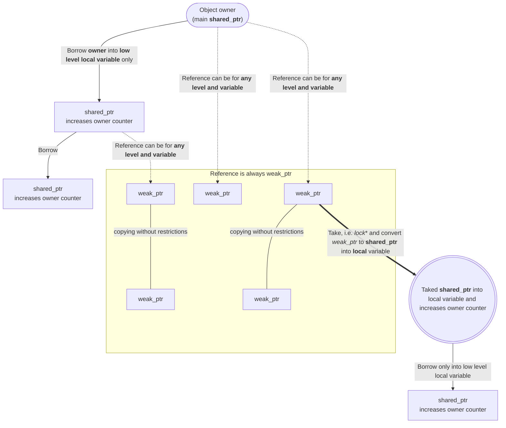

Любой язык программирования так или иначе вынужден управлять оперативной памятью.
В *NewLang* реализовано автоматическое управление памятью без сборщика мусора с *полным контролем ссылок*.

За основу была взята идея "владения" из языка Rust, но она переработана под концепцию 
сильных и слабых указателей (аналоги *shared_ptr* и *weak_ptr* из С++),
когда вделец объект не только заимствует владение объектом, 
но и допускается создание *контролируемых* копий объекта (*сильных* ссылок) в локальных переменных. 

Если локальная переменная с *сильным* указателем уходит из области видимости, 
счетчик ссылок на объект уменьшается, а при достжении нуля память объекта освобождается. 
Фактически, это автоматическое управление памятью с помощью подсчёта ссылок без использования сборщика мусора.

Под *"полным контролем ссылок"* имеется ввиду, что возможность получения ссылки на переменную 
должно быть декларировано в явном виде еще при объвлении или создании переменной.

Так как существование ссылок на объекты предполагает возможность одновременного доступа 
к ним из нескольких потоков, то *полный контроль ссылок* включают в себя и элементы межпотоковой синхронизации. 

При определении переменной указывается, какие типы ссылок допускается создавать,
и какая модель контроля совместного доступа должна быть использована.
При захвате ссылки, т.е. при преобразовании слабой ссылки (*weak_ptr*) в сильную (*shared_ptr*),
захват межпотокого объекта синхронизации производиться автоматический (если он используется).

Весь механизм контроля владения определяется правилам на **уровне синтаксиса**.
При создании переменой в рантайме выполняется контроль идентификатора потока для однопоточных ссылок, 
а все остальные проверки выполняются **во время компиляции**

###### Связь между "владением", "заимствованием", "ссылкой" и "захватом  сылки" приведена на диаграмме: {#diag}




## Управление памятью и терминология
- Выделить или освободить память вручную нельзя.
- Для каждого объекта выделение и освобождение памяти происходит автоматически при создании/удалении объектов (статически, на стеке или в куче).
- Объекты с точки зрения *владения*, могут быть:
  - *Владеющие* - содержат сильную ссылку (аналог *shared_ptr* из С++), которые увеличивают счетчик ссылок владения объектом.
  - *Не владеющие* - содержат слабую ссылку (аналог *weak_ptr* из С++) - указатели на другие объекты, которые не увеличивают счетчик ссылок владения объектом.
    Данные в таких объектах перед использованием требуется захватить (т.е. преобразовать *слабую* ссылку в *сильную* с увеличением счетчика владения).
- Ссылки на объекты, с точки зрения *совместного доступа*, могут быть:
  - *Легкие* - ссылки без объекта синхронизации (классические ссылки)
  - *Синхронизированные* - ссылки с объектом упрвления совметсным доступом (мьютексом).
- Переменные - владельцы объектов могут быть двух видов:
    - **[локальные (контролируемые)](https://en.wikipedia.org/wiki/Local_variable)** - 
    область жизни локальных переменных строго ограничена и определяется правилами синтаксиса языка (аргументы и локальные переменные функций и блоков кода, потоков и т.д.). 
    - **не контролируемые** - глобальные или статические переменные, динамически создаваемые объекты, время жизни которых *компилятор* не контролирует.
- Когда локальная переменная с *сильной ссылкой* удаляется - уменьшается счетчик ссылок, а при достижении нуля - объект освобождается.
- Переменная - владаец объекта, это **корневая** переменную с *сильной* ссылкой.
- Каждый объект может иметь только одну **корневую** переменную с *сильной* ссылкой
    и произвольное количество любых дргуих типов ссылок в *локальных (контролируемых)* переменных. 

- Все ссылки в языке являются *слабыми*, которые перед использованием требуется *захватить*, 
    т.е. превратить слабую ссылку в сильную и сохранив ее в *локальную (контролируемую)* переменную.
- Управление временем жизни объекта включает в себя не только управлением памятью, 
    но и отвечает за работу механизма синхронизации доступа. 
    Для этого, при определении переменной сразу определяется возможные типы ссылок, которые разрешено на нее создавать:
    - без создания ссылок, т.е. компилятор не даст создать ссылку на данную переменную, 
        а совместный доступ к такой переменой будет не возможен
    - разрешено создание *легкой* ссылки ("**&**") и ее использование только в текущем потоке. 
        Компилятору при генерации машинного кода не нужно создавать объект синхронизации доступа.
    - разрешено создавать *тяжелые* ссылки с монопольным доступом ("**&&**").
        Компилятор автоматически создает не рекурсивный мьютекс для синхронизации доступа к переменной.
    - разрешено создавать *тяжелые* ссылки с рекурсивным доступом ("**&\***"). 
        Компилятор автоматически создает рекурсивный мьютекс (его можно захватывать в одном потоке несколько раз).
    - *легкая* ссылка может для совместного доступа ("**&?**").
        Для работы с ними требуется использовать [групповой](/ru/docs/ops/with/) захват ссылок.
 
*Ссылки для полей структур или объектов могут быть только *легкими*.*

- Все виды ссылок могут быть константными ("**&^**", "**&?^**", "**&&^**" или "**&\*^**"), 
    т.е. только для чтения (и в случае константных объектов, таким ссылкам мьютекс не потребуется).
- Захват ссылки может быть индивидуальным или [групповым](/ru/docs/ops/with/) 
    с сохранением результата в *локальную (контролируемую)* переменную. 
    Такое использование логики захвата объекта на уровне синтаксиса языка, гарантирует последующее 
    автоматическое освобождение временной переменной, 
    что равнозначно невозможности создания сильных циклических ссылок, которые могут приводить к утечкам памяти.
- Ссылка на переменную создается тогда, когда в правой части оператора создания/присвоения присутствует любой из операторов получения ссылки 
(**&**, **&&**, **&\*** или **&^**, **&&^**, **&\*^**).  
- Во всех остальных случаях создается копия данных с сильной (владеющей ссылкой). 
Но копировать данные можно только в переменные, расположенные ниже уровеня владельца, либо возвращать объект из функции.

### Захват ссылки и значение переменной {#take}
- Захват ссылки - это преобразование *слабой* ссылки в *сильную* с её сохранением в контролируемую переменую 
с инкрементом счетчика ссылок и возможностью доступа к значению объекта. Это очень похоже на заимствование (Borrowing) в Rust, 
так как тоже позволяет использовать данные, находящиеся во владении другой переменной, но **без перехода владения**.

Для захвата ссылок используются операторы: 
 - '**\***' - автоматический выбор типа доступа (чтения/запись или только чтение) 
 - '**\*^**' - захват доступа только для чтения
 - '**\*\*( ... )**' - [групповой](/ru/docs/ops/with/) захват ссылок в *локальные (контролируемые)* переменные
 
Упрощенный условный пример:
```python
    ref := & owner;  # переменная ref - слабая ссылка на owner
    ref_ro := &^ owner;  # слабая ссылка на owner только для чтения

    val := *ref;  # Автоматический захват только для чтения 
    *ref = val;    # Автоматический захват для чтения/записи
    obj.*ref = 123; # Запись значения по ссылке ref - члена класса/структуры
    *ptr.*ref = 123; # Запись значения по ссылке ref - члена класса/структуры, которая тоже является ссылкой

    val := *^ ref; # Захват только для чтения

    val := *^ ref_ro; 
    val := * ref_ro;  # Автоматический захват только для чтения
    *ref_ro = val;    # Ошибка - ссылка только для чтения !!!
    *^ ref_ro = val;  # Ошибка - недопустима конструкция (захват lval - только для чтения)
```

- Слабую ссылку можно захватить (превратить в сильную) сохранив результат в локальной переменной,
    после чего работать с локальной переменной "по значению" 
    без необходимости захватытвать ссылку при каждом обращении к переменной.
- Значение переменной - владельца нельзя скопировать в другую переменную или поле объекта, 
но можно клонировать данные или обменяться значениями "**:=:**" с другой переменной с сильной ссылкой (swap).
- Значение переменной - ссылки можно копировать в другие переменные или поля без ограничений.

Примеры владения:
```python
    owner := "string";
    other := "string 2";

    owner = other; # Ошибка - нельзя копировать!
    *owner = *other; # Копирование данных
    owner :=: other; # Обмен значениями (swap)
    other = _; # Очистка данных объекта
```
 
- Переменную, содержащую ссылку на ссылку создать нельзя, 
но можно создать ссылочный тип и после этого создать переменную-ссылку на этот тип данных.

Упрощенный условный пример:
```python
    value := 123;
    :RefInt := & Integer;
    ref_int :RefInt := & value;
    ref_ref := & ref_int;
    
```

- Если переменная владелец разрешает создавать ссылки на объект, тогда при обращении к такой переменой 
требуется выполнять захват объекта для обеспечения работы механизма совместного доступа.
- При использовании переменной - владельца как rvalue, оператор захвата ссылки можно не указывать (он будет выполняться автоматически).

## Ссылки и совместный доступ

Управление временем жизни переменной включает в себя не только управление памятью, 
но и механизм синхронизации для монопольного/раздельного доступа к объектам из разных потоков.

Примеры ссылок:
```python
    & local := 123;     # Разрешено создание ссылок только в текущем потоке
    && thread := 456;   # Разрешено создание ссылок с монопольным доступом в любом потоке
    
    ref := & local;     # Создание слабой ссылки на local
    ref2 := && local;   # Ошибка! многопоточные ссылки не разрешены
    ref_th := && thread;  # Создание слабой ссылки на thread 
                          # c монопольной блокировкой доступа

    local += 1; # ОК
    thread  += 1; # Ошибка, требуется захват объекта с разеляемым доступом
    
    *local += 1; # ОК, оператор захвата игнорируется
    *thread  += 1; # Захват объекта (как захват слабой ссылки)
    
    ref += 1;   # Ошибка, требуется захват слабой ссылки
    ref_th += 1;   # Ошибка, требуется захват слабой ссылки
    
    *ref += 1;   
    *ref_th += 1;
```

Операторы захвата ссылки и синхронизации доступа к объекту выполняются только для одного действия над переменной.
Но захват объекта синхронизации, это относительно медленная операция и выполнять её для каждого действия над переменной не рационально.

Для того, чтобы однократно захватить объект(ы) синхронизации для выполнения сразу нескольких действий 
над переменными можно захватить объект в локальную переменую или использовать [менеджер контекста](/ru/docs/ops/with/).


### Пример программы

```python
    rand():Int32 ::= %rand...; # Создание объекта
    @( rand():Int32 ); # Предварительное объявление (объект должен быть создан в другом месте)
    rand():Int32 = ...;

    usleep(usec:DWord64):None := %usleep...;
    printf(format:FmtChar, ...):Int32 := %printf...;


    func(count:Integer, target:String) := {
        $iter := @iter( 1..$count ); # Итератор для диапазона от 1 до $count
        @while( @curr($iter) ) {   # Цикл, пока итератор валидный
            
            $step := @next($iter);  # Получить текущий и перейти на следующий элемент итератора
            
            printf('Number %d from %s!', $step, $target);
                
            usleep( rand() % 1000 );    # Случайная задержка
        }
    }

    thread = :Thread(func, 5, 'thread');

    thread.start();

    func(5, 'main');

    thread.join();

```

```pyton
    Number 1 from the thread!
    Number 1 from the main!
    Number 2 from the thread!
    Number 2 from the main!
    Number 3 from the thread!
    Number 4 from the thread!
    Number 3 from the main!
    Number 4 from the main!
    Number 5 from the main!
    Number 5 from the thread!
```


Примеры ссылок:
```python
    & $local := 123;     # Разрешено получение легких ссылок
    && $thread := 456;   # Доступ к переменной требует захвата тяжелой ссылки
    
    $ref := & $local;     # получение слабой ссылки на local
    $ref2 := && $local;   # Ошибка! Тяжелой многопоточные ссылки не разрешены
    $ref_th := && $thread;  # Получение слабой ссылки на thread 
                            # c монопольной блокировкой доступа

    $local += 1; # ОК (для легких ссылок блокировка объекта не требуется)
    $thread  += 1; # ОК (захват объекта происходит автоматически)

    $ref += 1;   # Ошибка, требуется захват легкой слабой ссылки
    $ref_th += 1;   # Ошибка, требуется захват тяжолой слабой ссылки
    
    *$local += 1; # ОК
    *$thread  += 1; # ОК
    *$ref += 1;   # ОК (только захват ссылки, блокировка игнорируется)
    *$ref_th += 1;   # ОК (захват ссылки и блокироваки доступа)
```

## Менеджер контекста

Операторы захвата ссылки и синхронизации доступа к объекту выполняются только для одного действия над переменной.
Но захват объекта синхронизации, это относительно медленная операция и выполнять её для каждого действия над переменной не рационально.

Для того, чтобы однократно захватить объект(ы) синхронизации для выполнения сразу нескольких действий 
над переменными используется [менеджер контекста](/ru/docs/ops/with/).

